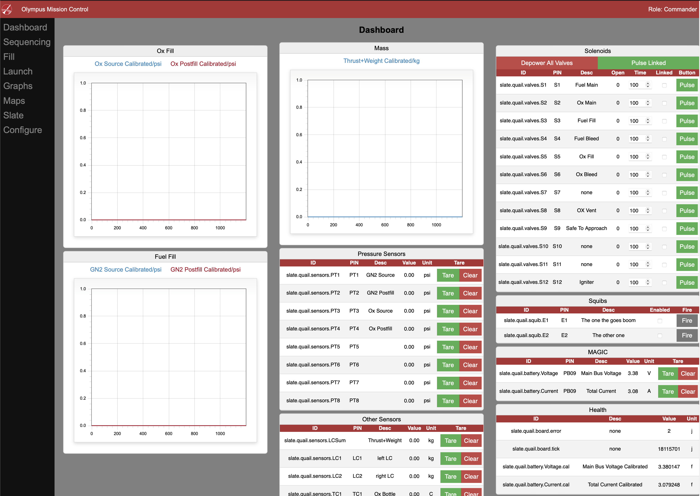
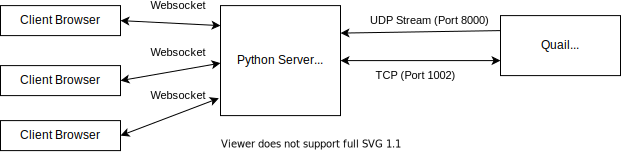
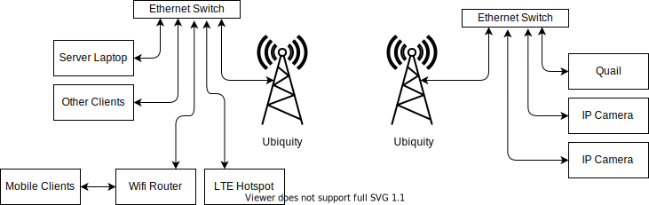

# Olympus Ground Control

Ground station code that interfaces with the Quail GSE board to provide the ground control interface for olympus 

## Quickstart

### Setup

Make sure you're using at least python version 3.7. Heads up that installing it on ubuntu with pip isn't as simple as it should be.  I recomend using a virtual enviroment.

Run `pip install -r requirements.txt` to install the dependancies

### Usage

Ensure you're on the same network (and have a ip address in the right range) as quail.

To launch dev server `adev runserver main.py --port 8080 --livereload`

To launch "deployment" server `python main.py`

Go to `localhost:8080` to see the page (only after it connects to quail). That access from a differnt computer on the same network go to `{server ip}:8080` on that computers browser

## Feature rundown

### Dashboard Page(s)

### Slate Page

Shows a live updating view of the raw slate. Useful for debugging

### Configuration

This page allows you to authenticate you browser using the password `MAGIC` to send commands to quail. Otherwise you're an observer who can't influence quail (except to add ing to server load). There's also a buttong allowing you to reboot quail and send raw commands (eg `{'slate.quail.battery.Voltage.ofs': 0.0}` to remove voltage taring)

### Stream integration

In addition to the pages listed in the sidebar the server also exposes the `/mass_graph` `ox_graph` and `fuel_graph` pages that are useful for embedding into a live stream

### Map

Currently not used for anything but could be used for stuff like rocket tracking down the line. It should be realativly easy to plot a location on it from gps coordinates in the slate. Any area that you've alreadys looked at is cached so that you don't need an internet connection to look at it again.

## Architecture

### Description

The repo functions basically as a http server that serves the webui to any browser. It relays data and commands to the quail and back. It uses socketio to communicate to the browser and a mixture of UDP and TCP to talk to quail. 

### Dataflow

(Note those diagrams can be opened and edited using the drawio VS code extension. Please update them as stuff changes :D). The server IP is the defualt IP but if a server with a different IP connects to quail (with new firmware) it should update the location it sends the udp stream

### Physical Conenctions

### Code Structure

## HTML Generation
## Client side code
## Authentication

### TODOs

- Bug in graph rescaling on changed units: Autorescaling doesn't work poperly on graphs with converted units
- Make units changing safer: Currently we don't assert at all what unit we are converting from etc. Once quail reports all units we should turn this on
- Write readme: In progress
- Enabled logging: Since quail *should* log stuff to SD this isn't a top prority but it should happen. Note that in development mode the server will reload on any file changes in this repository so the logs should be placed elsewere to avoid a reload loop